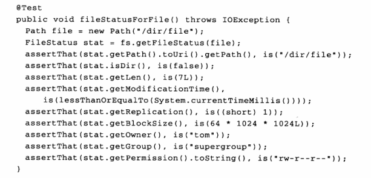
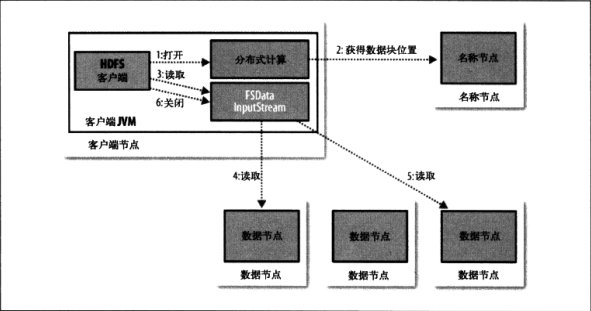
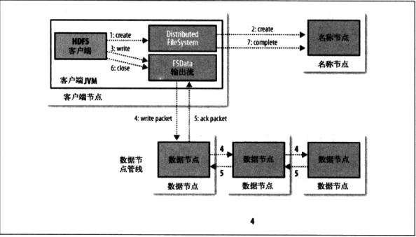

# Hadoop分布式文件系统

- 特点：
  - 优点
    - 处理超大文件
    - 流式数据访问：一次写入，多次读取
    - 商用硬件：可以在可靠性不高的平台上使用
  - 缺点
    - 无法低延迟访问数据，用HBase是更好的选择
    - 大量的小文件
    - 无法实现多用户写入和任意修改文件
- 概念：
  - 块：默认64M
  - NameNode(管理者)：维护文件系统树及树内所有的文件和索引目录；记录每个文件的每个块所在数据节点；
  - DataNode(工作者)：存储提供定位块的服务，且定时向namenode发送他们存储的块的列表。
  - SecondaryNameNode：定期通过编辑日志合并并命名空间镜像

### HDFS中的JAVA接口

- 从hadoop URL中**读取数据**：

  一般的格式：

```Java
InputStream in = null;
try {
    in = new URL("HDFS://host/path").openStream();
    //process in
} finally {
    IOUtils.closeStream(in);
}
```

需要做的就是让JAVA识别Hadoop文件系统的url，解决方案有两个

(1)	特点：使用**setURLStreamHandlerFactory(new FsUrlStreamHandlerFactory());**，一个Java虚拟机中只能调用一次.

```Java
static {
    URL.setURLStreamHandlerFactory(new FsUrlStreamHandlerFactory());
}
//下面process in的部分为
IOUtils.copyBytes(in, System.out,4096,false);
```


（2）使用FileSystem API读取数据，使用**get**方法得到FileSystem对象，随后用**open**函数来得到文件的输入流，返回的实际上是FSDataInputStream对象，支持**随机访问，可以从流的任意位置来读取数据**，提供接口**seekable**,下面有三个方法，**seek(long pos)**，找到pos位置，**getPos()**，查询当前位置相对于文件开始处的偏移量。

```Java
public class readFile_new {
    public static void main(String[] args) throws Exception {
        String uri = args[0];
        Configuration conf = new Configuration();
        FileSystem fs = FileSystem.get(URI.create(uri), conf);
        InputStream in = null;
        try {
            in = fs.open(new Path(uri));
            IOUtils.copyBytes(in,System.out,4096,false);
        } finally {
            IOUtils.closeStream(in);
        }

    }
}
```

- **写入数据**

  最简单的是给拟创建的文件指定一个路径对象，然后返回一个用来写的输出流

  ```Java
  public FSDataOutputStream create(Path f) throws IOException
  ```

  **推荐先用exist()来判定文件是否存在**

  新建文件的另一种方法是用**append()**来在已有的文件中追加：

  ```Java
  public FSDataInputStream append(Path f) throws IOException
  ```

  综合应用：

  ```Java
  public class FileCopyWithProgress {
      public static void main(String[] args) throws Exception {
          String localSrc = args[0];
          String dst = args[1];
          InputStream in = new BufferedInputStream(new FileInputStream(localSrc));
          Configuration conf = new Configuration();
          FileSystem fs  =FileSystem.get(URI.create(dst), conf);
          OutputStream out = fs.create(new Path(dst), new Progressable() {
              public void progress() {
                  System.out.print(".");
              }
          });
          IOUtils.copyBytes(in, out, 4096, true);
      }
  }
  ```

  **FileStream中的create()方法返回一个FSDataOutputStream,里面有getPos()函数**

- **查询文件系统**：**FileStatus**类封装文件系统中的文件和目录元数据，包括文件长度，块大小，副本，修改时间，所有者及许可信息。

  

- **列出文件**：**listStatus()**方法

  传入参数为一个文件时，会简单返回长度为1的FileStatus对象的一个数组；如果传入参数是一个目录时，会返回0或者多个FileStatus对象，代表着目录包含的文件和目录

  显示一个Hadoop文件系统中一些路径的文件信息

  ```Java
  public class ListStatus {
      public static void main(String[] args) thows Exception {
          String uri = args[0];
          Configuration conf = new Confifuration();
          FileSystem fs = FileSystem.get(URI.create(uri), conf);
          Path[] paths = new Path[args.length];
          for (int i = 0; i < paths.length; i++) {
              paths[i] = new Path[args[i]];
          }
          FileStatus[] status = fs.listStatus(paths);
          Path[] listedPaths = FileUtil.stat2Paths(status);
          for (Path p : listedPaths) {
          	System.out.println(p);       
          }
      }
  }
  ```

- **删除**数据：FileSystem中的delete()可以永久删除文件或者目录

  ```Java
  public boolean delete(Path f, boolean recursive) throws IOException
  ```

  若f为文件或者空目录，后面布尔类型会被忽略；当为非空目录时，只有为true时会删除数据。

### 数据流

- 文件读取剖析：P68
  

- 文件写入剖析：P73

  

### 通过distcp进行并行复制

- 一般用于两个HDFS集群中传输数据。如果集群在Hadoop的同一版本上运行，就适合使用hdfs方案：

  ```shell
  hadoop distcp hdfs://namenode1/foo hdfs://namenode2/bar
  ```

  从第一个集群中复制/foo目录到第二个集群中的/bar目录下，源路径必须是绝对路径。

### Hadoop归档文件

- 学习使用Hadoop Archives：

