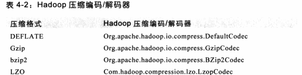

# Hadoop 的I/O

### 数据完整性

- 数据节点会在存储数据及其校验和前验证它们收到的数据。

- 客户端读取数据节点上数据，会验证校验和。

- 每个数据节点会在后台线程于宁一个DataBlockScanner（数据块检测程序），定期验证存储在数据节点上的所有块。

- HDFS存储这块的副本，如果读取数据块出错，会在抛出异常前报告该坏的块，以及它试图从名称节点中要读取的数据节点。名称节点将其标记为损坏的，因此不会直接复制，而是从其他的副本重新复制一个新的副本，并删除损坏的副本。

- ```Java
  FileSystem rawFs  = ...
  FileSystem checksumedFs = new ChecksumFileSystem(rawFs);
  ```

### 文件压缩

- 使用gzip来压缩和解压

```shell
gzip -1 file  //1表示速度最优，9表示空间最优
```

- 编码/解码器：

  hadoop中的编码/解码器是通过一个压缩解码器接口实现的



- CompressionCodec对流进行压缩和解压缩：有两个方法

  想要对正在被写入一个输出流的数据进行压缩，可以用createOutputStream方法创建一个CompressionOutputStream，将其以压缩格式写入底层的流

  想要对从输入流读取而来的数据进行解压缩，则调用createInputStream(InputStream in)函数，从而获得一个CompressionInputStream,从而从底层的流读取未压缩的数据

  压缩从标准输入读取到的数据，并写到标准输出：

  ```Java
  public class StreamCompressor {
      public static void main(String[] args) throws Exception {
          String codecClassname = args[0];
          Class<?> codecClass = Class.forName(codecClassname);
          Configuration conf = new Configuration();
          //创建新的实例
          CompressionCodec codec = (CompressionCodec) ReflectionUtils.newInstance(codecClass, conf);
          //获得压缩好的System.out
          CompressionOutputStream out =
                  codec.createOutputStream(System.out);
          //将输入复制到经过CompressionOutputStream压缩的输出
          IOUtils.copyBytes(System.in, out, 4096,false);
          out.finish();
      }
  ```

- 在MapReduce中使用压缩：

  如果输入的文件是被压缩过的，那么在被MapReduce读取时，他们会自动解压，根据文件扩展名决定使用哪一个压缩解码器

  若要压缩MapReduce作业输出，在作业配置文件中将mapred.output.compress属性设置为true，将mapred.output.compression.codec属性设置为自己打算使用的压缩编码器/解码器的类名